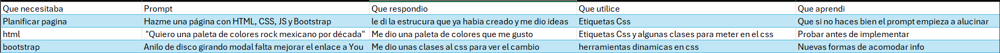
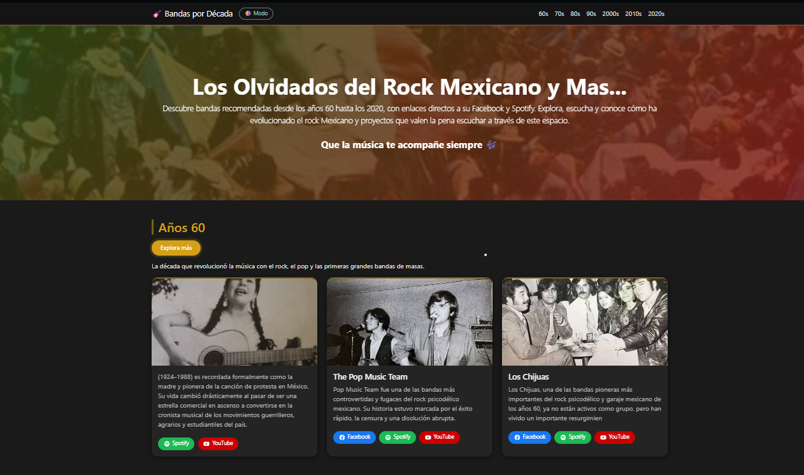
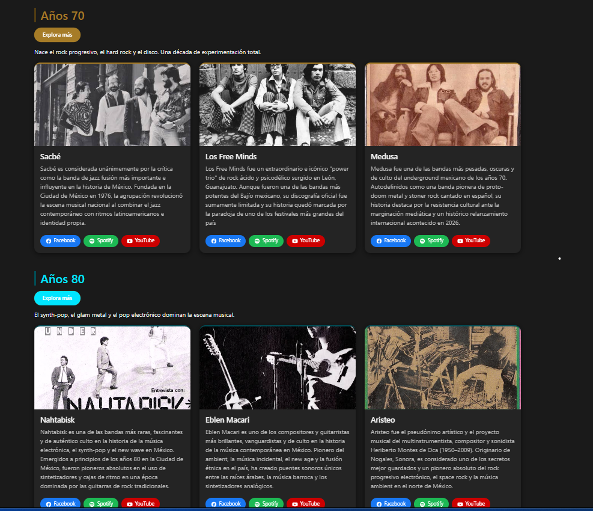
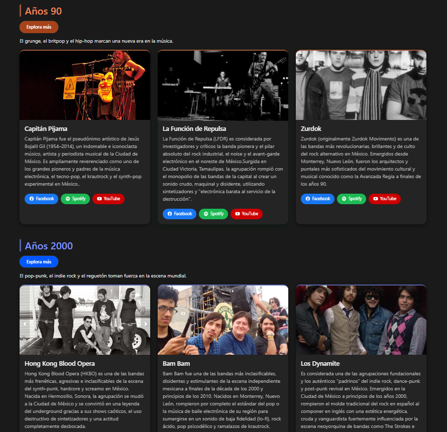
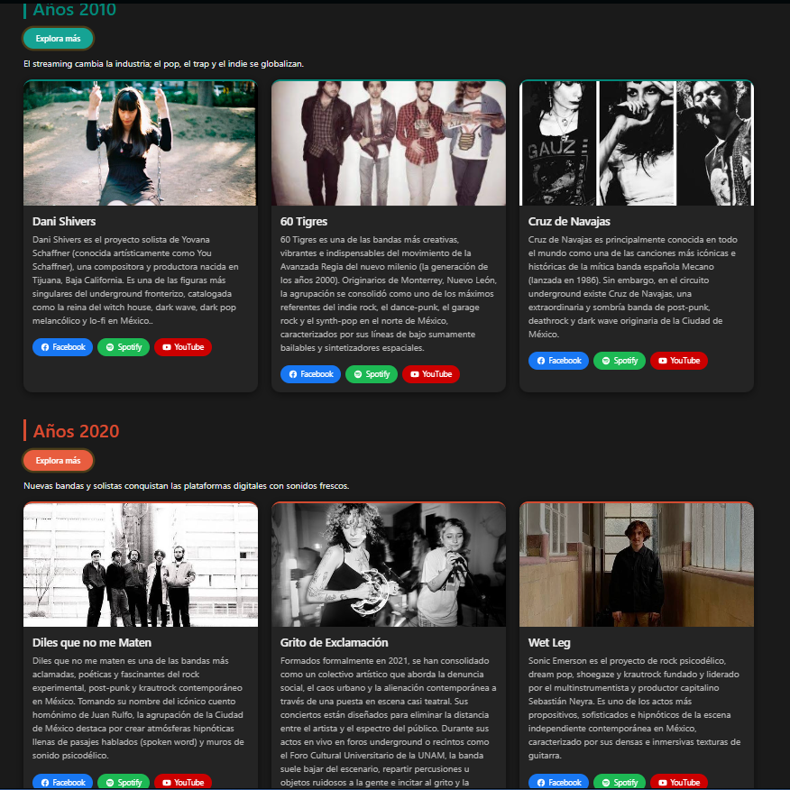
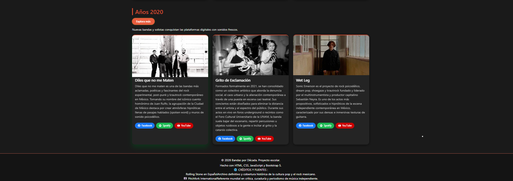
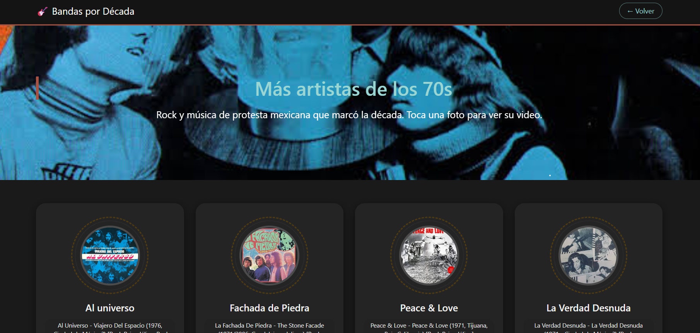
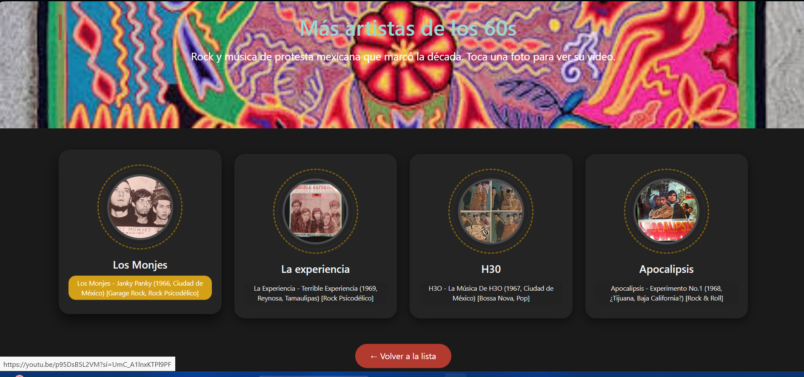

🎸 
## 1. Nombre del proyecto

Los olvidados del Rock Mexicano y mas..

Recomendación de proyectos musicales de Rock Mexicano


## 2. Descripción

Descubre bandas recomendadas desde los años 60 hasta los 2020, con enlaces directos a su Facebook y Spotify. Explora, escucha y conoce cómo ha evolucionado el rock mexicano y proyectos que valen la pena escuchar a través de este espacio.


## 3. Tecnologías

- HTML
- CSS
- Bootstrap
- JavaScript
- Git
- GitHub
- Claude AI


## 4. Proceso con IA

Prompt #1

Quiero una paleta de colores más típica del rock mexicano no tan rosa naranja y morado algo más enfocado en décadas sesenta colores más psicodélicos 70s más progresivos 80s más electrónica y punk y 90s más alternativo 2000s algo más novedoso no lo metas al código solo dame ideas.

prompt # 2

en el botón de conocer más o explora más ira a dar a otra página con información relevante de varios artistas lo que quiero es hacer  cuadros de reseñas donde salga otros cuatro artistas ya bajo en forma redonda 2 álbumes que sean recomendados y abajo unos enlaces de YouTube quiero que esta página tenga cosas dinámicas dame ideas ya que ese será el esqueleto para las demás décadas


## 5. Código generado vs. código propio

La IA me ayudó bastante en los **estilos y animaciones** (el anillo giratorio tipo disco, el degradado del hero y el centrado del contenido). El resto — la paleta de colores en variables, la tipografía, el navbar, los títulos y bordes por década, y los botones — lo fui ajustando y escribiendo yo mismo con base en lo que ya tenía.

<details>
<summary>💡 Ver código generado con ayuda de la IA (animaciones y hero)</summary>

```css
/* Anillo exterior, gira sin parar */
.disco-giratorio::before {
  content: "";
  position: absolute;
  inset: 0;
  border-radius: 50%;
  border: 3px dashed var(--acento-pagina, var(--mostaza));
  animation: girar-disco 7s linear infinite;
}

/* Segundo anillo, más tenue, gira al revés (efecto vinilo) */
.disco-giratorio::after {
  content: "";
  position: absolute;
  inset: 8px;
  border-radius: 50%;
  border: 1px solid rgba(255, 255, 255, 0.25);
  animation: girar-disco 5s linear infinite reverse;
}

.hero-overlay-degradado {
  position: absolute;
  inset: 0;
  background: linear-gradient(135deg, rgba(24, 79, 4, 0.8), rgba(147, 4, 11, 0.8));
  z-index: 1;
}

.hero-contenido {
  position: relative;
  z-index: 2;
  min-height: 320px;
  display: flex;
  flex-direction: column;
  justify-content: center;
}
```

</details>

<details>
<summary>✍️ Ver código propio (paleta, navbar, cards, botones)</summary>

```css
:root {
  --carbon: #1a1a1a;
  --carbon-claro: #242424;
  --oxido: #b23a2e;
  --mostaza: #0a4c4b;
  --acento-60: #d4a017;
  --acento-70: #a67c27;
  --acento-80: #00e5ff;
  --acento-90: #a6431b;
  --acento-2000: #0057ff;
  --acento-2010: #16a394;
  --acento-2020: #e85d3f;
}

body {
  font-family: 'Segoe UI', Verdana, sans-serif;
  background-color: var(--carbon);
  color: #e8e8e8;
}

.mi-navbar {
  background-color: #141414;
  border-bottom: 3px solid var(--oxido);
}

.mi-navbar .nav-link:hover {
  color: var(--mostaza);
}

.titulo-decada {
  color: var(--mostaza);
  border-left: 6px solid var(--oxido);
  padding-left: 12px;
}

.card-banda {
  background-color: var(--carbon-claro);
  border-top: 4px solid var(--oxido);
  border-radius: 16px;
  box-shadow: 0 4px 14px rgba(0, 0, 0, 0.5);
  transition: transform 0.3s ease, box-shadow 0.3s ease;
}

.card-banda:hover {
  transform: translateY(-10px) scale(1.02);
}

.btn-mi-boton {
  background-color: var(--oxido);
  color: #ffffff;
  border-radius: 20px;
  padding: 6px 16px;
}

.btn-mi-boton:hover {
  background-color: var(--mostaza);
  color: #1a1a1a;
}
```
> Código completo disponible en [`css/styles.css`](css/styles.css)

</details>


## 6. Aprendizaje

No sabía cómo animar algunas secciones, y la IA me ayudó bastante a darle un poco más de dinamismo a la página.

También en la paleta de colores me recomendó tonos que iban de acuerdo a lo que quería, aunque hubo veces que yo mismo la modifiqué porque no me gustaba cómo se veía. Diría que fue un trabajo 50/50 entre lo que propuso la IA y mis propios ajustes.

## 7.Reflexión
¿Hubo algún momento en que la IA generó código que no comprendía?

Sí, hubo varios momentos. Aprendí que hay que saber preguntar bien para no repetir cambios innecesarios, ya que a veces al pedir un ajuste, la IA modificaba otras partes del código sin que yo lo pidiera.

¿Qué hice al respecto?

Siempre respaldé mis prototipos antes de volver a pedir o copiar nueva información, para no perder avances si algo salía mal.




## 📸 Capturas de la página








